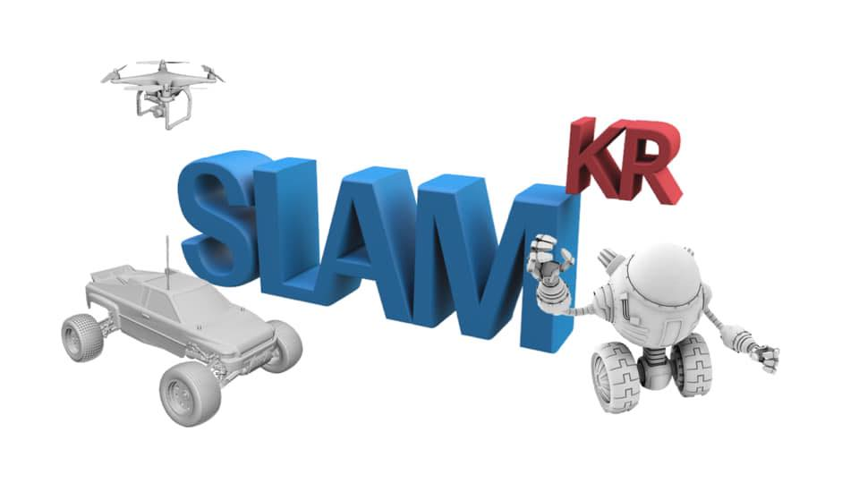

# Awesome SLAM KR List

  
[SLAM KR](https://www.facebook.com/groups/slamkr)  
SLAM 연구 관련하여 정보를 나누는 공간입니다.
학문적 이론에서
실제적 구현을 거쳐
재미있는 응용으로 까지
다양한 SLAM 관련 주제에 대해서 공유하고 토론하는 장이 되었으면 좋겠습니다.  
For the foreign members,
This facebook group is the place to share the information about SLAM research. You can freely post some threads regarding theoretical papers, practical implementations, and interesting applications.
Even though this is Korean group, we are welcome to discuss in English.
Thank you all :-).

[SLAM Computer Vision google search query](https://www.google.com/search?q=slam+computer+vision&newwindow=1&source=lnt&tbs=qdr:m&sa=X&ved=0ahUKEwiYn8SEgLnhAhVvm-AKHdZaCqsQpwUIJA&biw=1280&bih=1306)

- Prerequisites  
[Modern C++ for Image Processing and Computer Vision](https://www.youtube.com/playlist?list=PLgnQpQtFTOGR50iIOtO36nK6aNPtVq98C)  
[홍정모의 따라하며 배우는 C++](https://www.inflearn.com/course/following-c-plus)  
[인프런 선형대수학](https://www.inflearn.com/course/%EC%84%A0%ED%98%95%EB%8C%80%EC%88%98%ED%95%99%EA%B0%9C%EB%A1%A0)  
[이상엽 선형대수학](https://www.youtube.com/playlist?list=PL127T2Zu76FuVMq1UQnZv9SG-GFIdZfLg)   

- SLAM tutorial  
[SLAM KR Online SLAM Study](https://www.youtube.com/playlist?list=PLubUquiqNQdOTNocmWCSWk9ZaWhV7ubCD)  
[SLAM KR Online Autonomous Driving Study ](https://www.youtube.com/playlist?list=PLubUquiqNQdOYYUqJF1YeAcDqFJ0sryUF)  
[Mobile Robotics Lecture from Michigan](http://robots.engin.umich.edu/mobilerobotics/?fbclid=IwAR1NcjOxtgv6ohDPxFkAXIMDn91933IgGSXvav0HpO8lBWwCP0agFkoUS5A#lectures)  
[Autonomous Mobile Robot from ETH](https://www.edx.org/course/autonomous-mobile-robots-2?fbclid=IwAR04dfIKlPZ1IU39T2TiIOik96vs8Crs5lxWVnAy2nylHZ7jZph0hBtyRZU)  
[장형기님 자료](https://www.notion.so/SLAM-c007647dafbb41579bc683ea64eef55f)

- SLAM Survey Paper  
Past, Present, and Future of Simultaneous Localization And Mapping: Towards the Robust-Perception Age.  
Simultaneous Localisation and Mapping (SLAM): Part I.    
Simultaneous Localisation and Mapping (SLAM): Part II.  
A Survey of Simultaneous Localization and Mapping.  
A Tutorial on Graph-Based SLAM.  
A review of recent developments in Simultaneous Localization and Mapping.  
Visual Odometry [Tutorial]. Part I: The First 30 Years and Fundamentals.  
Visual Odometry. Part II: Matching, Robustness, Optimization, and Applications.  
Multiple-Robot Simultaneous Localization and Mapping: A Review.  
Visual Place Recognition: A Survey.  
A Critique of Current Developments in Simultaneous Localization and Mapping.    
[An Overview to Visual Odometry and Visual SLAM: Applications to Mobile Robotics](https://link.springer.com/article/10.1007/s40903-015-0032-7?fbclid=IwAR2j_ERnMT8ywstuWp6HXdF8qBaqF1Qt4E_0XJWI_8_ZPGQxMDRcoBt7jbw)

- Dataset  
[Awesome SLAM Datasets](https://sites.google.com/view/awesome-slam-datasets/home?authuser=0)  
[NaverLabs HD Map Dataset](https://hdmap.naverlabs.com/?fbclid=IwAR0KTdF2IkMxsqnsULMbfieFxfZT-17_VSw_e5WqtJ-8YsF3QIaKzPeJ_g4)  
[SemanticKITTI Dataset](http://semantic-kitti.org/)  

- Book  
[Welcome to 14 Lectures on Visual SLAM: From Theory to Practice](https://github.com/gaoxiang12/slambook-en?fbclid=IwAR1GWb4XSm06ENIUWjJB_LKiujRF5tC-rHNkRVDcPIUo_zu8tXTg4DS_o6s)
[SLAM KR Book](https://drive.google.com/drive/folders/11LDCG3B-roaPddIuhKhu0mMzSmWrnCO0?ths=true)    

- SLAM Tech Startup
SLAMCore
KudanSLAM
Stryx
Mobiltech

- Lidar SLAM System  
> (1) 2D SLAM  
Gmapping  
FastSLAM  
HectorSLAM  
KartoSLAM  
LagoSLAM  
CoreSLAM  
Cartographer  

> (2) 3D SLAM  
LOAM  
LeGO-LOAM  
Cartographer  
IMLS-SLAM  
Interactive SLAM  
LOAM-livox

> (3) Deep learning with Lidar SLAM  
>> Feature & Detection:  
PointNetVLAD  
VoxelNet  
BirdNet  
LMNet  
PIXOR  
YOLO3D  
PointCNN  
MV3D  

>> Recognition & Segmentation:  
PointNet  
PointNet++  
VoteNet  
SegMap  
SqueezeSeg  
PointSIFT  
PointWise  
3P-RNN  
SPG  
SegMatch  
KD-Network  
DeepRemporalSeg  
PointRCNN  

>> Localization:  
L3-Net  
SuMA++  

- Visual SLAM System  
> (1) Sparse Visual SLAM    
MonoSLAM  
PTAM  
ORB-SLAM (v1, v2)  
Inertial ORB-SLAM  
ProSLAM  
ENFT-sfm  
ENFT-SLAM  
OpenVSLAM  
TagSLAM  
UcoSLAM  

> (2) SemiDense Visual SLAM  
LSD-SLAM  
SVO  
SNN-SVO  
DSO  
EVO  

> (3) Dense Visual SLAM  
DTAM  
MLM SLAM  
Kinect Fusion  
DVO  
RGBD-SLAM V2  
Kintinuous  
RTAB-MAP  
Dynamic Fusion  
VolumeDeform  
Fusion4D  
Elastic Fusion  
InfiniTAM  
Bundle Fusion  

> (4) Visual Inertial Odometry SLAM  
SSF  
MSCKF  
MSCKF-VIO  
ROVIO  
OKVIS  
VINS Mono  
Vins Mobile  
VINS Fusion  
ICE-BA  
Maplab  
VI-ORB  
StructVIO  
RKSLAM  

> (5) Deep Learning with Visual SLAM  
Feature & Detection:  
Pop-up SLAM  
SuperPoint  
GCN-SLAM  
SalientDSO  
CubeSLAM  
MonoGRNet  
Recognition & Segmentation:  
SLAM++  
SemanticFusion  
MarrNet  
3DMV  
Pix3D  
ScanComplete  
Fusion++  
Mask-RCNN  
SegMap  
3D-SIS  
DA-RNN  
DenseFusion  
CCNet  
Recovery Scale:  
CNN-SLAM  
DeepVO  
GS3D  
UnDeepVO  
GeoNet  
CodeSLAM  
GEN-SLAM  
Deep-MVS  
Pose Output & Optimization:  
PoseNet  
VINet  
DeepVO  
SFM-Net  
VSO  
MID-Fusion  
VidLoc  
Long-term Localization  
X-View  
Semantic Visual Localization  
Dynamic SLAM  
RDSLAM  
DS-SLAM  
MaskFusion  
Co-Fusion  
Detect-SLAM   
DynaSLAM  
StaticFusion  
[SLAMANTIC](https://github.com/mthz/slamantic?fbclid=IwAR1fS0LH8VQ6REGLU76MQbNTz0L561QtBllCV78iOAJeBWR72JGx-FTjT2o)  
[Kimera](https://arxiv.org/abs/1910.02490)

- Lidar and Visual SLAM System  
> Multiple Sensors Calibration   
>> Camera & IMU:  
Kalibr  
Vins-Fusion  
MSCKF-VIO  
IMIU-TK  
Camera & Depth:  
BAD SLAM  

>> Lidar & IMU:  
LIO-Mapping  
Lidar-Align  
Camera & Lidar  
Lidar-Camera  
RegNet  
LIMO  
CalibNet  
Autoware  
SVIn2  

>> Lidar and Visual Fusion  
Hardware layer  
Data layer  
Task layer  

- Multi-agent, Collaborative SLAM  
[Summer School on Multi-robot Systems](http://mrs.felk.cvut.cz/summer-school-2019/?fbclid=IwAR3p7qP5WrSMGDdaK6Xj5MK_TkC-8WPwdS0qyZ76Tye8djn7X8HbWxHXjrg)  

- Novel SLAM approaches  
[NeuroSLAM Project](https://www.neuroslam.net/?page_id=40&fbclid=IwAR2HVCxnkP-4xwihha2jIOkl92hhsQJTI-TLF83McHrOrNqwpPaKQ5G3xDE)
 
- SLAM Lab  
http://irap.kaist.ac.kr/  

- BLOG  
[Jinyong Jeong's blog](http://jinyongjeong.github.io/tag/SLAM/)  
[SLAMCore blog](https://blog.slamcore.com/)  
[GTSAM blog](https://gtsam.org/)

